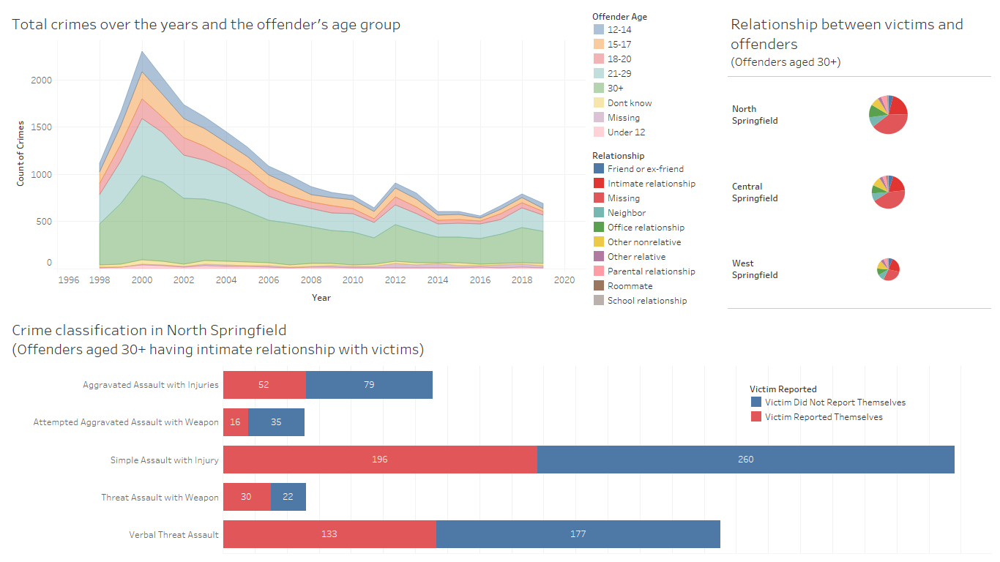
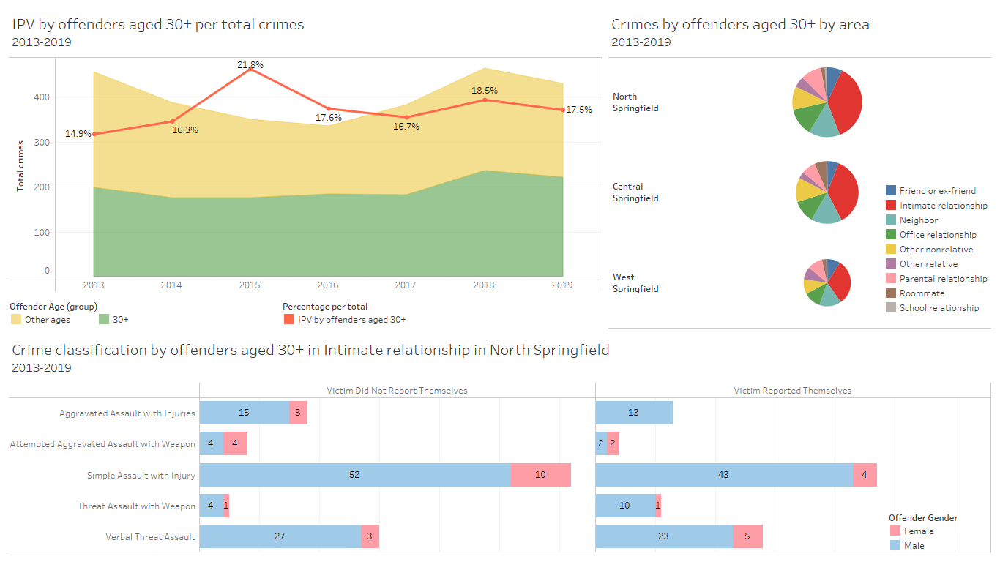
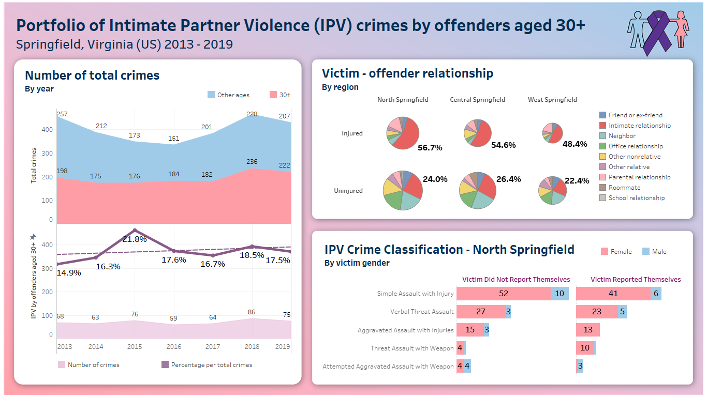

# Springfield Dashboard
Case Study: Data-driven transformation of Springfield’s police force.

 🔎🔎🔎 Visit my dashboard with [Tableau Public](https://public.tableau.com/views/Digital_Dashboard/Final?:language=en-US&:sid=&:redirect=auth&:display_count=n&:origin=viz_share_link) 🔥🔥🔥 here! 

---
Outline:
- [Springfield Dashboard](#springfield-dashboard)
- [Background 📜](#background-)
- [Implementation 🚧](#implementation-)
  - [Adressing problems](#task-1-why-is-the-problem-important-and-how-will-developing-the-dashboard-help-to-address-the-problem)
  - [Early draft](#task-2-include-exactly-1-screenshot-of-the-early-draft-of-your-digital-dashboard-provide-a-description-of-how-you-designed-and-developed-the-early-draft-of-your-digital-dashboard)
  - [Advanced draft](#task-3-include-exactly-1-screenshot-of-the-advanced-version-of-your-digital-dashboard-provide-a-description-of-how-you-designed-and-developed-your-digital-dashboard-explaining-the-transition-from-the-early-draft-to-the-advanced-version)
  - [Final version.](#task-4-include-exactly-1-screenshot-of-the-final-version-of-your-digital-dashboard-provide-a-description-of-how-you-designed-and-developed-your-digital-dashboard-explaining-the-transition-from-the-advanced-version-to-the-final-version)
  - [Recommendations](#task-5-provide-recommendations-to-improve-reality-based-on-the-data-visualisation-relative-to-the-case-study-context-the-recommendations-do-not-necessarily-need-to-provide-solutions-but-can-refer-to-next-steps-the-stakeholders-should-take-what-further-analysis-is-required)

---
# Background 📜
Springfield, Virginia in the United States of America has been collecting data on the crimes that have been occurring in the city boundaries between 1998 and 2019. 
The data includes details on the offender, the nature of the crime, the location of the crime, and further details. 
The dataset contains over 23,000 instances of crimes which have occurred.
Due to increasing negative media attention, there is a growing perception by the citizens of Springfield that they are no longer safe. They are starting to complain and resent the elected officials. Because next year is an election year, the Mayor, Mayor Jones, is growing increasingly concerned about the social welfare of the citizens she is responsible for. Mayor Jones has previously delegated the responsibility of the crime portfolio to her police chief, Chief Odinson. It is Chief Odinson’s responsibility to run the entire police force across the areas within Springfield: 
- Central Springfield (postal code: 22150)
- North Springfield (postal code: 22151)
- West Springfield (postal code: 22152).
  
Mayor Jones organised to meet with Chief Odinson to gather the information she needed to transform the city. When she met with Chief Odinson, the Chief was perplexed, he was unsure on how to gather the information the Mayor required. The Chief did know that the police officers in each precinct within each area completed reports about every case (some initiated by the victim, others by witnesses). He also knew that the data on the reports was inputted into an Excel file. Yet, he was not sure on how to extract what he needed from the data file.

Recognising his uncertainty and wanting to provide the necessary information to the Mayor, Chief Odinson decided to hire your team of consultants to see how they can best leverage the data that the Chief had access to. Yet, rather than just finding the information to assist Mayor Jones, the Chief decided to take this opportunity to improve how he manages the police. He also met with Police Officer, Sergeant Steve Rogers to see if there is anything data-related that could help the Sergeant perform his duties. Sergeant Rogers informed the Chief that many of his fellow police officers of the Springfield Police Department required more information to understand the nature of the crimes in the area, so that they can be better equipped to respond.
Stakeholder groups
You are required to identify a data-driven approach to provide insights in the form of a digital dashboard to assist the following stakeholders:
- Mayor Jones – to improve societal issues surrounding crimes (focus on all suburbs overall).
- Chief Odinson – to manage the Springfield Police Department in Central Springfield, North Springfield, and West Springfield (compare the three suburbs).
- Sergeant Rogers – to be more informed of the crimes in the local areas (focus on one suburb only).

---

# Implementation 🚧

## Task 1: Why is the problem important and how will developing the dashboard help to address the problem?

>*Scope: Specify one problem from the overarching challenge of improving the safety of the city. Look into the data and identify one aspect, which you think will help the stakeholders achieve their objectives through the support of the digital dashboard.*

The provided dataset has presented statistics on the criminal cases in the three suburbs of Springfield, Virginia (US), between 1998 and 2019. It can be extracted from the data that the offenders in their middle age (over their 30s) committed the most crimes, up to 50%, in terms of both city and suburb levels, for any interval of time. Drilling down the relationship between the offender and victims reveals that people in intimate partner relationships were more likely to be involved in criminal records. As a result, domestic violence, particularly intimate partner violence is significant enough to propose itself as an essential problem to the safety of citizens in the area. In the dataset and the real world, people tend to cause more violence when they have closed contact frequently. Living together may depress people with different burdens of life, in common and individually. The intimate relationship is fundamental to the formation of a family. If this relationship experiences discomfort continuously, it is possible to negatively impact people themselves, the next generations, and the whole of society.

From this problem, a digital dashboard can be built to visualise the data more insightfully to help Mayor Jones, Chief Odinson, and Sergeant Rogers be informed about the criminal situation to various extents. Crimes have been recorded over the years, which allows the Mayor to understand the overall trend and pattern of social issues in approximately 20 years. Through this, she can identify which area should be focused on and direct practical resources effectively. The dataset also categorised records by postal codes. Demonstrating the problem of intimate partner violence in each suburb enables Chief Odinson to operate the police department across the city boundaries. However, he only needs to access general insight because he still has to improve his management by handling the detail and specific tasks for Sergeant Steve Rogers. From the dataset, it is noticeable that North Springfield is the most unsafe among the three suburbs, with the highest instances of crime. The dashboard can filter all records in this region and display detailed information on victims and the nature of crimes. Eventually, the Sergeant can extract from it some wisdom to respond to future cases, as well as report to his higher officer.

---

## Task 2: Include exactly 1 screenshot of the early draft of your digital dashboard. Provide a description of how you designed and developed the early draft of your digital dashboard.

As mentioned in the dashboard motivation, I started exploring the data over the years. Line charts or area charts would be preferable to display trends as they illustrate the data source as a series of data points. This chart will reveal the theme of each member in a category. When I viewed the number of crimes by offender age, I was impressed by the proportion of offenders older than 30, accounting for approximately half of the total crimes even when the area chart dropped to less than a quarter of its peak in 2000. 

However, the root problem was the intimate relationship. To help Chief Odinson understand clearly among the suburbs, I used the pie chart because it can show the elements of a dimension and compare the quantity and the size of a measurement. In this case, I paid attention to the relationship between the victim and the offender. From the crimes committed by over 30-year-old offenders, I separated the data into three different postal codes representing the suburbs. For a more transparent interpretation, I replaced the code with the name of the corresponding areas. At this stage, Chief Odinson could focus on North Springfield when he noticed that the size of the pie chart was the biggest, showing that this area was the most critical one. 

Then he assigned the Sergeant to examine some aspects of crimes carefully. The dashboard utilised flexibility, and multi-dimensional presentation to classify the crimes in North Springfield, regarding the middle age offender in intimate relationships. Sergeant Steve Rogers could look at each type of crime and how serious a crime would be. In addition, I added the term victim Reported so that he could develop some ideas to encourage victims to reach out for protection.

---

## Task 3: Include exactly 1 screenshot of the advanced version of your digital dashboard. Provide a description of how you designed and developed your digital dashboard explaining the transition from the early draft to the advanced version.

Looking back to the dashboard in the earlier draft, I noticed something which might not be significant or relevant to my problem. The most common term of mayor is four years, and the most prolonged period is six years. The 20-year duration from the dataset might not be helpful to the upcoming election of Mayor Jones. Instead, I narrowed the duration to 2013 – 2020 so she could be exposed to the latest and up-to-date data subset. This subset was also applied to the rest of the dashboard. To make it more convincing, I calculated the percentage of crime classified as intimate partner violence caused by over-30-year-old offenders, which showed an upward trend. However, this proportion seemed to be relatively minor.

The relationship between victims and offenders in pie charts for Chief Odinson witnessed the removal of the “Missing” element. Offenders with no relationship with victims are more likely to commit a crime unintentionally, which is unexpected to study further to provide actionable solutions. After the removal, the scale stayed the same among the three suburbs, but the percentage of the Intimate relationship had proved its dominant proportion in the total crime.

The third chart for Sergeant appeared to be data-insufficient. We all know that women are more at risk in a relationship than men. I wondered if that general concept could fit in this dataset situation, so I added the offender's gender to show its connection with crime classification. However, the previous version had stacked the values by “Victim Reported.” To add more data, I had to split the stacked bar chart into two columns to make room for offender gender. The data successfully supported the concept when 90% of offenders were men.
Overall, compared to the early draft, more additional features give each stakeholder a deeper understanding of their concerns.

---

## Task 4: Include exactly 1 screenshot of the final version of your digital dashboard. Provide a description of how you designed and developed your digital dashboard explaining the transition from the advanced version to the final version.

The advanced version showed all the essential insight for Mayor, Chief, and Sergeant. On the other hand, the visualisation could have been more smart and appealing. The presentation of data also missed some annotations. As a result, the dashboard needed to be modified to transform into the final version.

Firstly, I modified all data presentations. The trend of the main problem, intimate partner violence of over 30-year-old offenders, was separated into a new area with the filtered numeric count of crimes and equipped with a trend line. Mayor Jones could be informed about the total crimes and the specific problem quickly without looking at the overlapped line/area chart. For Chief Odinson, the relationship between victims and offenders was enhanced by the displayed maximum percentage and injury status. All pie charts showed the same pattern: the intimate relationship accounted for the highest proportion. Although the number of uninjured cases was remarkable, the injured crime rate caused by intimate relationships reached an alarming percentage (56.7%), posing a caution for Chief Odision to consider. The last chart for Sergeant experienced a substitution from offender gender and victim gender. It did not affect the final conclusion of protecting women against IPV, but it would make this chart more consistent when I just focused on the victims’ perspective. I sorted the crimes in descending order to highlight the degree of severity. 

Secondly, I organised the dashboard more brilliantly for better visual effects. For my primary color palette, I selected light pink, light blue, and purple and their variations to present female, male, and IPV symbols. The charts were arranged into individual blocks with appropriate panes, legends, axes, and legends 

## Task 5: Provide recommendations to improve reality based on the data visualisation relative to the case study context. The recommendations do not necessarily need to provide solutions but can refer to next steps the stakeholders should take (what further analysis is required).

The dashboard has visualised the data relating to the case study of Springfield’s police force. The data, however, need to be recorded more carefully and decently so that the visualisation can reflect the situation at a higher reliability. Thanks to this reference, researchers and policymakers would be able to access the correct pattern and insight to adjust their actions and policies accordingly. In terms of data collection, it is also necessary to take into account the status of re-arresting. As mentioned in the dashboard creating motivation, intimate partner violence tends to repeat once it starts. Recording this kind of data can enrich the database's capability to improve the early identification of potential offenders.

Each stakeholder might take some next steps to improve reality thanks to the digital dashboard. Mayor Jones could propose sort of campaigns on a city level for several purposes. Not all issues relating to intimate partner relationships can be solved by law or regulation. In a good way, she could run educational programs that protect people under intimate partner violence and encourage the victims, especially women, to speak for themselves or report any possible threat from their partners. Even if it is a verbal threat, it is worthy of preventing misbehaviours from an early stage. At the same time, people who find it hard to self-control or cope with distress may need psychotherapy methods or instruction from the mass media to relieve negative feelings.

Some practical implementations can be operated by the police force led by Chief Odinson. Considering the intimate relationship, particularly in North Springfield, the Chief can allocate officers to patrol or provide better security services around the neighborhood, such as offering victims temporary accommodation support, legal advice, or cooperating with social groups to facilitate mediation solutions. 
Sergeant Steve Rogers is the one who has the closest contact and proper observation of the local situation. The data from the dashboard can direct him to more attention to women in families. As simple assault with injuries has the highest rate, he may show people simple self-defense tips. At least they can avoid injury, escape the situation, and seek further help. He is also responsible for updating crime records to higher officers so that the police headquarters can operate on time and effectively.
